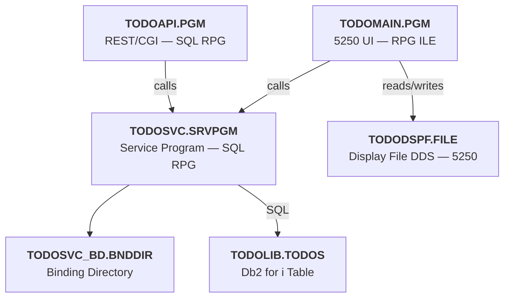

# IBM i To-Do List Application

A native IBM i application for managing to-do items, featuring both a **5250 interactive interface** and a **REST/CGI API**. Written entirely in ILE RPG (free-format) and SQL RPG, backed by Db2 for i.

---

## Table of Contents

- [Architecture](#architecture)
- [Project Structure](#project-structure)
- [IBM i Objects](#ibm-i-objects)
- [Prerequisites](#prerequisites)
- [Build](#build)
- [Running the 5250 Application](#running-the-5250-application)
- [5250 Screen Navigation](#5250-screen-navigation)
- [REST API](#rest-api)
- [Post-install Verification](#post-install-verification)
- [License](#license)

---

## Architecture

The application is organized into **3 layers** that share the same business logic through a service program:



| Layer | Objects | Role |
|---|---|---|
| **Presentation** | `TODOMAIN.PGM`, `TODODSPF.FILE` | Interactive 5250 screen with subfile |
| **API** | `TODOAPI.PGM` | REST/CGI handler for IBM HTTP Server (IWS) |
| **Business logic** | `TODOSVC.SRVPGM`, `TODOSVC_BD.BNDDIR` | Shared CRUD operations (used by both programs) |
| **Data** | `TODOLIB.TODOS` | Db2 for i SQL table |

---

## Project Structure

```
ibm-i-To-Do-List-Application/
├── docs/
│   └── api.yaml              # OpenAPI 3.1 specification
├── qbndsrc/
│   └── todosvc_bd.bnddir     # Binding directory source
├── qcpysrc/
│   └── todosvc_h.rpgle       # Copybook – TODOSVC prototypes & data structures
├── qddssrc/
│   └── tododspf.dspf         # Display File source (5250 subfile)
├── qrpglesrc/
│   └── todomain.pgm.rpgle    # 5250 interactive program
├── qsqlrpglesrc/
│   ├── todosvc.sqlrpgle      # Service program (business logic)
│   └── todoapi.pgm.sqlrpgle  # REST/CGI program
├── qsqlsrc/
│   └── todos.sql             # Table DDL
├── qsrvsrc/
│   └── todosvc.bnd           # Binder language for TODOSVC
├── Rules.mk                  # Root makefile (delegates to sub-directories)
└── iproj.json                # IBM i Project configuration (TOBI/makei)
```

---

## IBM i Objects

| Object | Type | Source file | Role |
|---|---|---|---|
| `TODOLIB` | `*LIB` | — | Container library for all objects |
| `TODOS` | `*FILE (*TABLE)` | `qsqlsrc/todos.sql` | Db2 table (`TODOID`, `NAME`, `DONESTATUS`) |
| `TODODSPF` | `*FILE (*DSPF)` | `qddssrc/tododspf.dspf` | 5250 display file (subfile) |
| `TODOSVC` | `*MODULE` → `*SRVPGM` | `qsqlrpglesrc/todosvc.sqlrpgle` | Shared business logic (CRUD) |
| `TODOSVC_BD` | `*BNDDIR` | `qbndsrc/todosvc_bd.bnddir` | Binding directory (`TODOSVC` + `QTMHCGI`) |
| `TODOMAIN` | `*PGM` | `qrpglesrc/todomain.pgm.rpgle` | Interactive 5250 front-end |
| `TODOAPI` | `*PGM` | `qsqlrpglesrc/todoapi.pgm.sqlrpgle` | REST/CGI handler (IWS) |

### Service program API (`TODOSVC`)

The copybook [`qcpysrc/todosvc_h.rpgle`](qcpysrc/todosvc_h.rpgle) exposes the following procedures:

| Procedure | Returns | Description |
|---|---|---|
| `GetAllsTodos(todos)` | `int(10)` count | All todos regardless of status |
| `GetPendingTodos(todos)` | `int(10)` count | Pending (not done) todos only |
| `GetDoneTodos(todos)` | `int(10)` count | Done todos only |
| `AddTodo(todo)` | `1` / `0` | Add a new todo; `0` if duplicate ID |
| `UpdateTodoStatus(todoId, done)` | `1` / `0` | Toggle status; `0` if ID not found |
| `RemoveTodo(todoId)` | `1` / `0` | Delete by ID; `0` if ID not found |

---

## Prerequisites

- IBM i with **ILE RPG** and **SQL RPG** support
- **TOBI / makei** installed on the IBM i (recommended for automated builds)  
  — or manual CL command execution access
- **IBM HTTP Server (IWS)** configured for the CGI program (REST API only)
- The `TODOLIB` library created before compilation

---

## Build

### Automated build (recommended — TOBI / makei)

From the PASE shell on the IBM i:

```sh
OPT=*EVENTF makei build
```

Or to compile a single file:

```sh
OPT=*EVENTF makei compile -f {filename}
```

### Step-by-step CL commands

The following commands must be executed **in order**:

```cl
/* 1. Create the library */
CRTLIB LIB(TODOLIB) TYPE(*PROD) TEXT('To-Do List Application')

/* 2. Create the SQL table */
RUNSQLSTM SRCSTMF('/path/to/qsqlsrc/todos.sql') COMMIT(*NONE) NAMING(*SYS)

/* 3. Compile the Display File (DSPF) */
CRTDSPF FILE(TODOLIB/TODODSPF) SRCFILE(TODOLIB/QDDSSRC) SRCMBR(TODODSPF) +
         ENHDSP(*YES) RSTDSP(*YES) DFRWRT(*YES)

/* 4. Compile the TODOSVC module */
CRTSQLRPGI OBJ(TODOLIB/TODOSVC) SRCSTMF('/path/to/qsqlrpglesrc/todosvc.sqlrpgle') +
            OBJTYPE(*MODULE) OPTION(*EVENTF) DBGVIEW(*SOURCE)

/* 5. Create the TODOSVC service program */
CRTSRVPGM SRVPGM(TODOLIB/TODOSVC) MODULE(TODOLIB/TODOSVC) +
           SRCSTMF('/path/to/qsrvsrc/todosvc.bnd') +
           ACTGRP(*CALLER)

/* 6. Create the binding directory */
CRTBNDDIR BNDDIR(TODOLIB/TODOSVC_BD)
ADDBNDDIRE BNDDIR(TODOLIB/TODOSVC_BD) OBJ((TODOLIB/TODOSVC *SRVPGM) (QHTTPSVR/QTMHCGI *SRVPGM))

/* 7. Compile the 5250 program TODOMAIN */
CRTBNDRPG PGM(TODOLIB/TODOMAIN) SRCSTMF('/path/to/qrpglesrc/todomain.pgm.rpgle') +
           DFTACTGRP(*NO) ACTGRP(*NEW) BNDDIR(TODOLIB/TODOSVC_BD) +
           OPTION(*EVENTF *SRCSTMT) DBGVIEW(*SOURCE)

/* 8. Compile the REST program TODOAPI (optional for 5250 use) */
CRTSQLRPGI OBJ(TODOLIB/TODOAPI) SRCSTMF('/path/to/qsqlrpglesrc/todoapi.pgm.sqlrpgle') +
            OBJTYPE(*PGM) OPTION(*EVENTF) DBGVIEW(*SOURCE) +
            BNDDIR(TODOLIB/TODOSVC_BD)
```

---

## Running the 5250 Application

### Method 1 — Direct CALL (simplest)

```cl
CALL PGM(TODOLIB/TODOMAIN)
```

### Method 2 — Add library to the library list first

If `TODOLIB` is not already in the library list:

```cl
ADDLIBLE LIB(TODOLIB) POSITION(*FIRST)
CALL PGM(TODOMAIN)
```

### Method 3 — From the IBM i main menu

```cl
/* Type on the command line: */
GO MAIN
/* Then option 5 → 5 → Enter: */
CALL TODOLIB/TODOMAIN
```

### Method 4 — Create a menu shortcut

```cl
/* Create a custom menu in TODOLIB */
CRTMNU MENU(TODOLIB/TODOMENU) TYPE(*DSPF) TEXT('To-Do List')
/* Or launch directly: */
CALL PGM(TODOLIB/TODOMAIN)
```

---

## 5250 Screen Navigation

Once the program is running, the following function keys are available:

| Key | Action |
|---|---|
| `F3` / `F12` | Exit the application |
| `F5` | Refresh the list |
| `F6` | Add a new to-do |
| `F8` | Filter: Pending items only |
| `F9` | Filter: Completed items only |
| `F10` | Show all to-dos |

Use the **Sel** column on each row to act on individual items:

| Code | Action |
|---|---|
| `1` | Toggle status (Pending ↔ Done) |
| `4` | Delete the to-do |
| `5` | Display the full name in the message bar |

---

## REST API

The `TODOAPI.PGM` program is a **CGI handler** exposed through **IBM HTTP Server (IWS)**. It is **not** launched from a 5250 session. It shares the same business logic as `TODOMAIN` via `TODOSVC.SRVPGM`.

Default port: **8080**  
Full specification: [`docs/api.yaml`](docs/api.yaml)

### Endpoints summary

| Method | Path | Description |
|---|---|---|
| `GET` | `/todos` | Return all to-dos |
| `GET` | `/todo/pending` | Return pending to-dos |
| `GET` | `/todo/done` | Return completed to-dos |
| `POST` | `/todo` | Create a new to-do |
| `PUT` | `/todo/status/{id}/{status}` | Update the status of a to-do |
| `DELETE` | `/todo/delete?id={id}` | Delete a to-do by ID |

### Todo data model

```json
{
  "todoId": 1,
  "name": "Buy groceries",
  "todoDoneStatus": false
}
```

---

## Post-install Verification

```cl
/* Verify all objects exist in TODOLIB */
DSPLIB LIB(TODOLIB)

/* Or use WRKOBJ for detailed view */
WRKOBJ OBJ(TODOLIB/*ALL) OBJTYPE(*ALL)

/* Check the SQL table */
RUNQRY QRYFILE((TODOLIB/TODOS))

/* Or in interactive SQL (STRSQL) */
STRSQL
  → SELECT * FROM TODOLIB.TODOS
```

---

## License

Licensed under the [Apache License 2.0](LICENSE).
