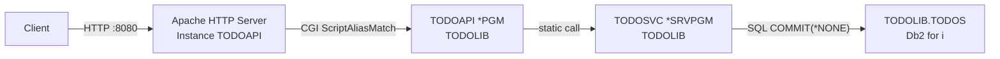

# Deployment — IBM i To-Do List API (REST/JSON CGI)

## Architecture



## Prerequisites

| Component | Minimum version |
|-----------|-----------------|
| IBM i OS  | V7R4M0          |
| 5770-WDS  | installed (RPG/SQL compiler) |
| 5770-DG1  | installed (IBM HTTP Server for i) |

## IBM i Object Structure

| Object | Library | Type | Notes |
|--------|---------|------|-------|
| `TODOS`      | `TODOLIB` | `*FILE` (SQL table) | Main table |
| `TODOSVC`    | `TODOLIB` | `*MODULE`           | Compiled with `COMMIT(*NONE)` |
| `TODOSVC`    | `TODOLIB` | `*SRVPGM`           | Service program bound via `TODOSVC_BD` |
| `TODOAPI`    | `TODOLIB` | `*PGM`              | Main CGI program |
| `TODOSVC_BD` | `TODOLIB` | `*BNDDIR`           | Contains `TODOSVC` + `QHTTPSVR/QTMHCGI` |

## Apache Configuration File

IFS path: `/www/todoapi/conf/httpd.conf`

```apache
# TODOAPI HTTP Server - port 8080

Listen *:8080
HotBackup Off
HostNameLookups Off
UseCanonicalName On
TraceEnable Off
KeepAlive Off
TimeOut 30000
ThreadsPerChild 5
DefaultFsCCSID 37
DefaultNetCCSID 819

CustomLog logs/access_log common
ErrorLog logs/error_log
LogLevel warn
LogMaint logs/access_log 7 0
LogMaint logs/error_log 7 0

DocumentRoot /www/todoapi/htdocs

# Add TODOLIB to the CGI job library list
SetEnv QIBM_CGI_LIBRARY_LIST TODOLIB

<Directory />
  Require all denied
</Directory>

# Route all /todo* URLs to the TODOAPI CGI program
# Note: ScriptAliasMatch does not populate PATH_INFO — the route is in SCRIPT_NAME
# TODOAPI handles this with a fallback to SCRIPT_NAME
ScriptAliasMatch ^/(todo.*) /QSYS.LIB/TODOLIB.LIB/TODOAPI.PGM

<Directory /QSYS.LIB/TODOLIB.LIB/>
  Require all granted
  Options +ExecCGI
</Directory>
```

### Critical Configuration Notes

- **`ScriptAliasMatch ^/(todo.*)`**: Apache places the route in `SCRIPT_NAME` (not `PATH_INFO`). `TODOAPI` reads `SCRIPT_NAME` as a fallback when `PATH_INFO` is empty.
- **`DefaultNetCCSID 819`**: Applies to static IFS files. The CGI response body must be converted to UTF-8 by the program itself (via `CAST ... CCSID 1208`).
- **`CGIConvMode`** not specified → defaults to `EBCDIC`: Apache does not convert CGI response bodies. The `EBCDIC → UTF-8` conversion is performed in `sendResponse()` via SQL `CAST`.
- **`SetEnv QIBM_CGI_LIBRARY_LIST TODOLIB`**: Required for the CGI job to resolve objects in `TODOLIB`.

## Compilation Notes

### TODOSVC (module + service program)

```
-- Module
CRTSQLRPGI OBJ(TODOLIB/TODOSVC)
           OBJTYPE(*MODULE)
           SRCSTMF('/path/qsqlrpglesrc/todosvc.sqlrpgle')
           COMMIT(*NONE)           <-- MANDATORY: CGI job has no journaling active
           OPTION(*EVENTF)
           DBGVIEW(*SOURCE)
           CLOSQLCSR(*ENDMOD)
           CVTCCSID(*JOB)

-- Service program
CRTSRVPGM  SRVPGM(TODOLIB/TODOSVC)
           MODULE(TODOLIB/TODOSVC)
           SRCSTMF('/path/qsrvsrc/TODOSVC.bnd')
           ACTGRP(*CALLER)
           AUT(*EXCLUDE)
```

> **Why `COMMIT(*NONE)`?** Apache CGI jobs start without journaling activated. The default `COMMIT(*CHG)` would raise `SQL0900` on every `INSERT`/`UPDATE`/`DELETE`. The `TODOS` table is not journaled, so `COMMIT(*NONE)` is the only viable option.

### TODOAPI (CGI program)

```
CRTSQLRPGI OBJ(TODOLIB/TODOAPI)
           SRCSTMF('/path/qsqlrpglesrc/todoapi.pgm.sqlrpgle')
           OPTION(*EVENTF)
           DBGVIEW(*SOURCE)
           CLOSQLCSR(*ENDMOD)
           CVTCCSID(*JOB)
           COMPILEOPT('TGTCCSID(*JOB)')
           RPGPPOPT(*LVL2)
```

## Deployment Script

See [`scripts/deploy.sh`](../scripts/deploy.sh) for the full bash deployment script.
